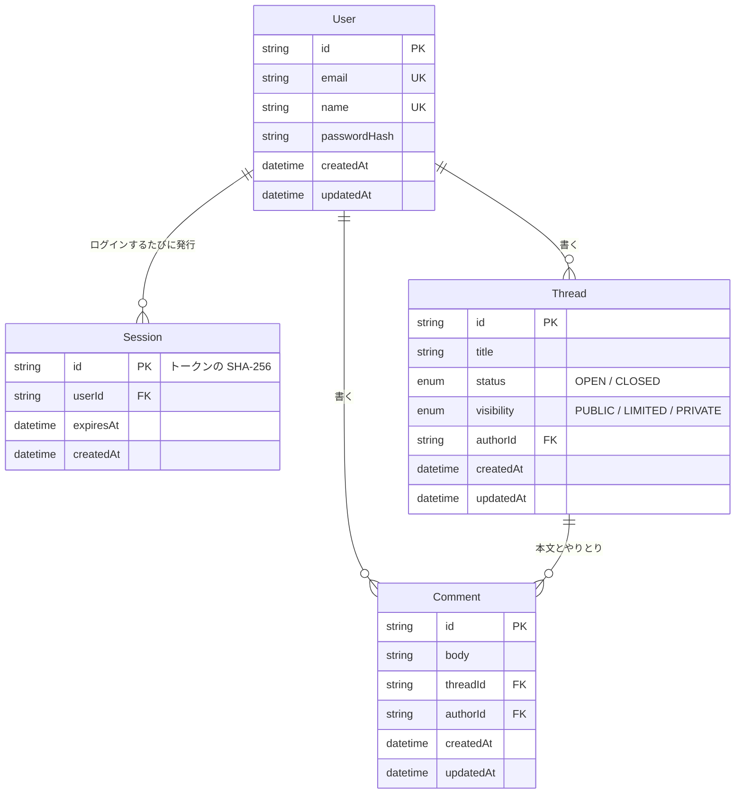

# Cascade

学習ログを「スレッド＋コメント」で記録する個人開発アプリ。
RareTECH ステップ449-457（マイアプリ作成ハンズオン）の提出物。

「調べたこと・詰まったこと」をスレッドとして立て、解決までの経過をコメントで
積み上げていく。スレッド単位で公開／限定公開／非公開を切り替えられる。

---

## 動作に必要なもの

| 必要なもの | 版 | 確認コマンド |
|---|---|---|
| Node.js | 22 以上 | `node -v` |
| npm | 10 以上 | `npm -v` |
| Docker | Compose v2 が使えるもの | `docker compose version` |

PostgreSQL をローカルに入れる必要はない（Docker で起動する）。

---

## セットアップ

初回だけ、上から順に実行する。

```bash
git clone https://github.com/mr110825/cascade202609.git
cd cascade202609

cp .env.example .env
```

**`.env` の `changeme` を書き換える。** `docker-compose.yml` の
`POSTGRES_PASSWORD` と同じ値にすること（この2つがずれていると DB に繋がらない）。

```bash
docker compose up -d          # PostgreSQL 17 を起動。healthy になるまで数秒待つ
docker compose ps             # STATUS が Up (healthy) を確認

npm ci                        # postinstall で prisma generate も走る
npx prisma migrate deploy     # prisma/migrations/ のマイグレーションを適用
npm run dev                   # http://localhost:3000
```

`npm ci` の `postinstall`（`prisma generate`）は `DATABASE_URL` を読まないので、
`.env` が無くても通る。DB に繋ぐのは `prisma migrate deploy` から。

ブラウザで <http://localhost:3000> を開き、「新規登録」からアカウントを作れば使える。

### 停止と再開

```bash
docker compose stop           # DB を止める（データは残る）
docker compose start          # 再開
docker compose down -v        # データごと消す。次回は migrate deploy からやり直し
```

### 詰まったら

| 症状 | 原因 | 対処 |
|---|---|---|
| `Bind for 0.0.0.0:5434 failed: port is already allocated` | 5434 を他のコンテナが使っている | 使っている側を止めるか、`docker-compose.yml` の `ports` と `.env` の URL を別番号に揃える。**失敗したコンテナが残るので `docker compose down` してから `up -d` し直す** |
| `P1000: Authentication failed against database server` | `.env` のパスワードが `docker-compose.yml` と違う（`changeme` のまま） | `.env` の値を `POSTGRES_PASSWORD` に合わせる |
| `P1001: Can't reach database server` | DB が起動していない／ポートが公開されていない | `docker compose ps` で `Up (healthy)` と `0.0.0.0:5434->5432/tcp` を確認 |

---

## 開発中に使うコマンド

| コマンド | 内容 |
|---|---|
| `npm run dev` | 開発サーバー（<http://localhost:3000>） |
| `npm run build` | 本番ビルド |
| `npm run typecheck` | `tsc --noEmit`。型だけを見る |
| `npm run lint` | ESLint |
| `npm run db:studio` | Prisma Studio。DB の中身をブラウザで見る |
| `npm run db:migrate` | スキーマを変えたときのマイグレーション作成（開発用） |

DB に直接 SQL を投げたいとき:

```bash
docker compose exec db psql -U cascade -d cascade
```

---

## 技術スタック

| レイヤー | 採用 | 選定理由 |
|---|---|---|
| フレームワーク | Next.js 16（App Router） | Server Component と Server Action で、フォーム送信に API を書かずに済む |
| 言語 | TypeScript 5 | |
| UI | React 19 | 状態は URL（`?edit=` `?q=` `?status=`）で持ち、クライアント側の state をほぼ使わない |
| CSS | Tailwind CSS v4 | `tailwind.config.js` は無い。デザイントークンは `globals.css` の `@theme` |
| DB | PostgreSQL 17（Docker） | ステップ455 で載せ替える Aurora の LTS が 17 系のため版を合わせている |
| ORM | Prisma 7 | Rust エンジン廃止版。接続は driver adapter（`@prisma/adapter-pg`）経由 |
| 認証 | 自前のセッション実装 | 認証ライブラリなし。argon2 + DB セッション + httpOnly Cookie |
| Markdown | react-markdown + remark-gfm + Shiki | コメント本文。コードブロックは github-dark で色が付く |
| 検索 | PostgreSQL の `ILIKE` | Prisma の `contains` + `mode: "insensitive"` |

---

## データモデル（4テーブル）



正本は `prisma/schema.prisma`。設計上のポイントは3つ。

- **`Thread` は本文を持たない。** 本文にあたるものは最初の `Comment`。
  「質問 → 経過 → 解決」が同じ形で一列に並ぶ。
- **`Session.id` にはブラウザへ渡した値そのものを入れない。** 入れるのはその
  SHA-256。DB が漏れても、そのままログインに使える値は入っていない。
- **`Visibility` は3値。** `PUBLIC` は誰でも、`LIMITED` は一覧に出ないが URL を
  知っていれば誰でも、`PRIVATE` は本人だけ。
- 外部キーはすべて `onDelete: Cascade`。ユーザーを消せばスレッドもコメントも消える。

タグのテーブルは無い（Phase 2 送り）。

---

## 画面

| パス | 内容 | ログイン |
|---|---|---|
| `/` | 公開スレッド一覧・検索・ステータス絞り込み | 不要 |
| `/signup` `/login` | 登録・ログイン | 不要 |
| `/dashboard` | 自分のスレッド一覧・検索・絞り込み | 必要 |
| `/threads/new` | スレッド作成 | 必要 |
| `/threads/[id]` | スレッド詳細（本文・コメント・公開設定の切替） | 公開設定による |
| `/settings` | ユーザー名変更・パスワード変更 | 必要 |
| `/terms` `/privacy` | 利用規約・プライバシーポリシー | 不要 |

スレッド詳細の「いま何を編集しているか」は URL の `?edit=` で表している
（`?edit=title` / `?edit=<コメントID>`）。クライアント側に状態を持たないので、
この画面は全部 Server Component で書けている。

---

## REST API

MVP の提供チャネルに REST API が入っているため、スレッドとコメントは API からも
操作できる。認証は画面と同じセッション Cookie を使う。

| メソッド | パス | 内容 |
|---|---|---|
| GET / POST | `/api/threads` | 公開スレッド一覧（`?q=` `?status=`）／作成 |
| GET / PATCH / DELETE | `/api/threads/:id` | 取得／タイトル・ステータス・公開設定の変更／削除 |
| GET / POST | `/api/threads/:id/comments` | コメント一覧／追加 |

画面と API は同じ `src/lib/services/*.ts` を呼ぶ。だから「画面では見えないのに
API では見える」といったずれが起きない。

---

## 認証と権限で守っていること

- パスワードのハッシュは自作せず `@node-rs/argon2` に任せる
- セッションIDは `crypto.randomBytes(32)`。**DB にはその SHA-256 を保存**する
- Cookie は `httpOnly` + `sameSite=lax` +（本番のみ）`secure`
- ログイン失敗のメッセージは「メールアドレスが無い」と「パスワードが違う」で変えない
- 見えてはいけないものは **403 ではなく 404** を返す（存在そのものを漏らさない）
- 更新・削除は `updateMany` / `deleteMany` の `where` に `authorId` を入れる。
  他人の ID を指定しても更新件数が 0 になるだけ
- `src/proxy.ts` は Cookie の有無しか見ない。**本当の確認は各ページの `requireUser()`**

---

## ディレクトリ構成

```
src/
  app/
    page.tsx            トップ（公開スレッド一覧）
    dashboard/          自分のスレッド一覧
    threads/            作成・詳細
    login/ signup/ settings/
    terms/ privacy/     法務ページ（DB を見ない）
    actions/            Server Action。フォームの受け口
    api/                REST API
    layout.tsx          全ページ共通の外枠
    globals.css         デザイントークンと共通クラス
  components/           表示部品（Header / Footer / ThreadCard / Markdown ほか）
  lib/
    services/           業務ロジック本体。画面と API の共通の土台
    auth.ts             「いまログインしているのは誰か」
    session.ts          セッションの発行・確認・破棄
    password.ts         ハッシュ化と照合
    prisma.ts           DB 接続（Prisma 7 の driver adapter）
  proxy.ts              未ログインを /login へ送る入口（Next.js 16 での middleware）
prisma/
  schema.prisma         テーブル定義
  migrations/           マイグレーション
```

呼び出しの向きは常に `page.tsx` / `route.ts` → `actions/` → `lib/services/` →
`lib/prisma.ts` の一方向。`services/` から画面を呼ぶことはない。

---

## 実装していないもの（意図的）

MVP 20件を実装している。以下は Phase 2 以降。

- タグ（付与・編集・絞り込み）… テーブルごと無し
- ページネーション・ソート切り替え・削除確認ダイアログ
- 本文（コメント）の全文検索。検索対象はスレッドのタイトルだけ
- 限定公開URLを共有するための導線（値と判定はあるが専用UIは無し）
- メール確認 / パスワードリセット / アカウント削除 / ログイン試行制限
- 画像アップロード
- 本番デプロイ（Amplify・Aurora）… ステップ455 で実施

---

## 注意

`npm audit` に警告が出るが、**`npm audit fix --force` は実行しないこと。**
Prisma を 6 系へダウングレードしようとするため、`src/lib/prisma.ts` の
driver adapter 構成ごと壊れる（`--dry-run` で確認済み）。
警告はいずれも Next.js / Prisma が内部で使っているパッケージのもの。

npm 11 はインストールスクリプトを既定でブロックする。承認済みのパッケージは
`package.json` の `allowScripts` に記録してある。

---

## ライセンス

学習目的の個人開発。ライセンスは設定していない。
